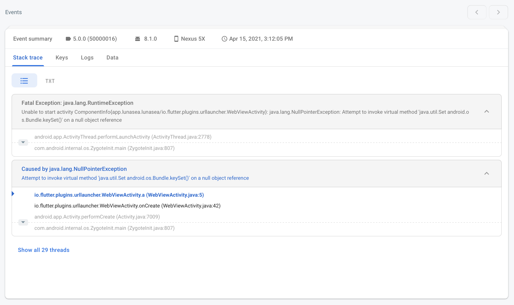

# Logs

LunaSea includes an on-device logging system that helps debug crashes, issues, and support requests. LunaSea stores 3 different levels of logs:

1. **Warning**: Warning logs are non-crashing and non-critical errors that have occurred on the device. Warning logs would occur when failing to load an image, passing an incorrect encryption key when trying to restore a backup, etc.
2. **Error**: Error logs are non-crashing but critical errors that have occurred on the device. Error logs would occur on network errors, connection issues, errors returned from the module, etc.
3. **Fatal**: Fatal logs are crashing errors or unhandled errors that have occurred on the device. Fatal logs would occur when LunaSea fails to complete  the boot process, fails to render the UI, etc.

### Viewing Log History

When a _handled_ error occurs, a toast notification will appear that allows you to directly view the error that just occurred.

LunaSea also stores a list of the **last 100 logs** that have occurred on the device. To access the history of logs, simply go to the Settings, enter the "System" page and tap "Logs".


The log database size is checked on startup, so all logs that have occurred in the active session will remain in the log history until LunaSea is closed and reopened.


### Exporting Logs

LunaSea offers the ability to export your logs into a JSON file, which can be easily sent to the developer to help debug the problems. The exported logs also include additional information, including the code-execution stack trace to see exactly where in the code the error occurred.

To export your logs, simply go to the Settings, enter the "System" page and tap "Logs". On this page, tap the "Export" button available at the bottom. After a short amount of time, a system-level sharesheet should appear with the ability to share or save the exported logs to your device.


Because the exported logs contain code-execution stack traces, **the logs may unintentionally contain private information**.

Please ensure you do not publicly share your exported logs \(or before sharing, manually scrub the exported logs\). Only share the logs to trusted parties through private channels such as email or direct messages.


### Clearing Logs

LunaSea offers the ability to clear all recorded logs from your device. While an available option, it is not recommended to clear your logs often as LunaSea will internally ensure the log database does not grow to an obscenely large size.

To clear your logs, simply go to the Settings, enter the "System" page and tap "Logs". On this page, tap the "Clear" button available at the bottom.

## Firebase Crashlytics

LunaSea integrates [Firebase Crashlytics](https://firebase.google.com/products/crashlytics) to help catch errors that may not be obvious to users or occur internally and out of sight. Firebase Crashlytics is enabled by default, but can be optionally completely disabled \(explained below\).

The following errors are not sent to Firebase Crashlytics to protect user's privacy and private information:

* **Networking Errors**: Any and all networking errors are not sent \(but are stored on the on-device logger\).
* **Encryption Errors**: Any and all errors related to encrypting or decrypting configurations for backups are not sent \(but are stored on the on-device logger\).


Firebase Crashlytics includes no personally identifying information in the logs that are sent. Information that is included in each log includes:

* Error
* Stack Trace
* Breadcrumbs
* Device Information \(Model, OS Version, etc.\)


### Example Crash Log

### Disabling Firebase Crashlytics

Disabling Firebase Crashlytics is as simple as heading to the Settings, entering the "System" page, and toggling off Firebase Crashlytics.

## Firebase Analytics

LunaSea integrates [Firebase Analytics](https://firebase.google.com/products/analytics) to help Firebase Crashlytics acquire breadcrumb information in any logs sent. Firebase Analytics is enabled by default, but can be optionally completely disabled \(explained below\).

### What are Breadcrumbs?

Breadcrumbs can almost be seen as a "history" of pages you have been on, which allows developers to understand _how_ you got to the point of experiencing the error.

### Other Analytic Logs

LunaSea also tracks these additional analytic metrics:

1. When a user opens the app.
   * Gives a general idea of how many users are actively using LunaSea
   * No identifying information is attached to this metric


Disabling Firebase Analytics will disable gathering and sending these additional metrics completely.


### Disabling Firebase Analytics

Disabling Firebase Analytics is as simple as heading to the Settings, entering the "System" page, and toggling off Firebase Analytics.

### 

